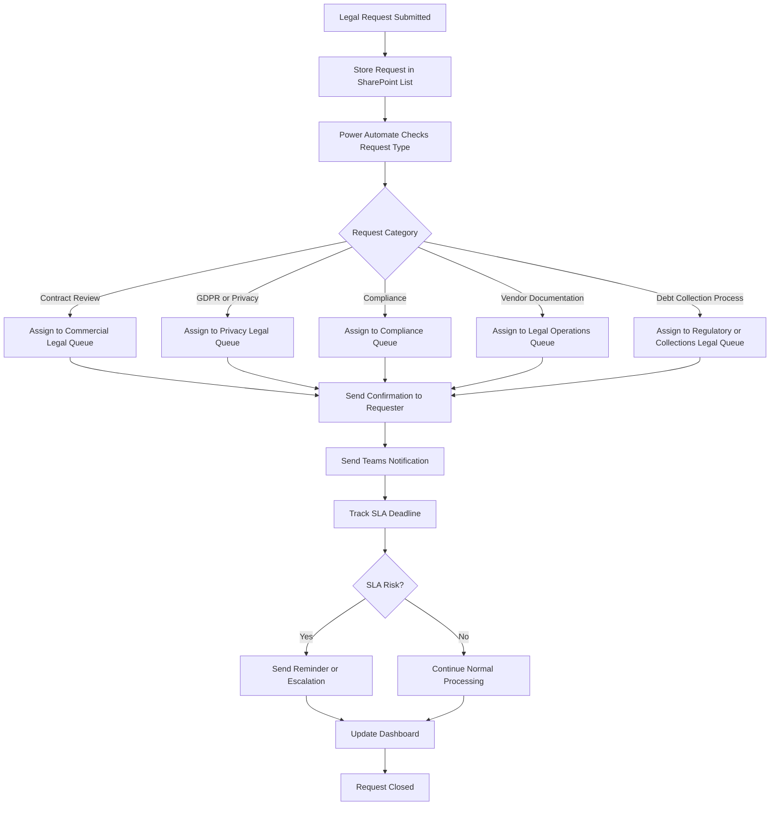

# Power Automate Workflow Logic

This document explains the low-code/no-code automation logic for legal request routing.
# Low-Code / No-Code Automation Logic

## Purpose

This document explains a simulated low-code/no-code automation concept for routing legal requests, sending notifications, tracking status, and updating KPI reporting.

The workflow is designed around Microsoft Power Platform concepts such as Power Apps, Power Automate, SharePoint Lists, Microsoft Teams, and Power BI.

## Suggested Tool Stack

| Tool | Purpose |
|---|---|
| Microsoft Power Apps | Create legal request intake interface |
| Microsoft Forms | Simple legal request submission option |
| SharePoint List | Store submitted legal requests |
| Power Automate | Automate routing, notifications, reminders, and status updates |
| Microsoft Teams | Notify Legal team and business stakeholders |
| Power BI | Monitor KPIs, request volume, SLA performance, and backlog |
| Microsoft Excel | Support early-stage reporting and data preparation |

## Automation Flow

1. Business user submits a legal request form
2. Request data is stored in a SharePoint List
3. Power Automate checks the request category
4. Request is assigned to the correct legal queue
5. Priority is calculated based on urgency, business impact, and risk level
6. Confirmation email is sent to the requester
7. Microsoft Teams notification is sent to the Legal team
8. SLA reminder is triggered before the deadline
9. Request status is updated during the process
10. Power BI dashboard refreshes for reporting visibility

## Automation Flow Diagram



## Example Routing Logic

| Request Type | Assigned Queue |
|---|---|
| Contract Review | Commercial Legal |
| Data Protection / GDPR | Privacy Legal |
| Debt Collection Process | Regulatory / Collections Legal |
| Vendor Documentation | Legal Operations |
| Compliance Policy | Compliance Team |
| Customer Communication Review | Legal + Business Owner |

## Example Priority Logic

| Condition | Priority |
|---|---|
| Regulatory risk = High | High |
| Customer impact = High | High |
| Business deadline within 2 days | High |
| Standard contract review | Medium |
| General policy clarification | Low |
| Knowledge base article available | Self-service option |

## Example Automation Rules

```text
IF request_type = "Contract Review"
AND contract_value > 50000
THEN priority = High
AND assign_to = Commercial Legal Queue
```

```text
IF request_type = "GDPR Question"
AND personal_data_involved = Yes
THEN priority = High
AND assign_to = Privacy Legal Queue
```

```text
IF request_type = "General Legal Guidance"
AND knowledge_base_article_available = Yes
THEN redirect_to = Self-Service Knowledge Base
```

## Notification Logic

| Trigger | Notification |
|---|---|
| New request submitted | Confirmation email to requester |
| Request assigned | Teams message to legal queue |
| SLA deadline approaching | Reminder to assigned owner |
| SLA overdue | Escalation notification |
| Request completed | Closure email to requester |

## Automation Benefits

- Less manual routing
- Faster response time
- Better workload visibility
- More consistent legal service delivery
- Reduced operational bottlenecks
- Improved stakeholder experience
- Stronger KPI reporting foundation

## Skills Demonstrated

- Low-code/no-code workflow thinking
- Power Platform awareness
- Legal operations process design
- Automation logic
- Stakeholder notification planning
- SLA tracking
- Operational efficiency improvement
