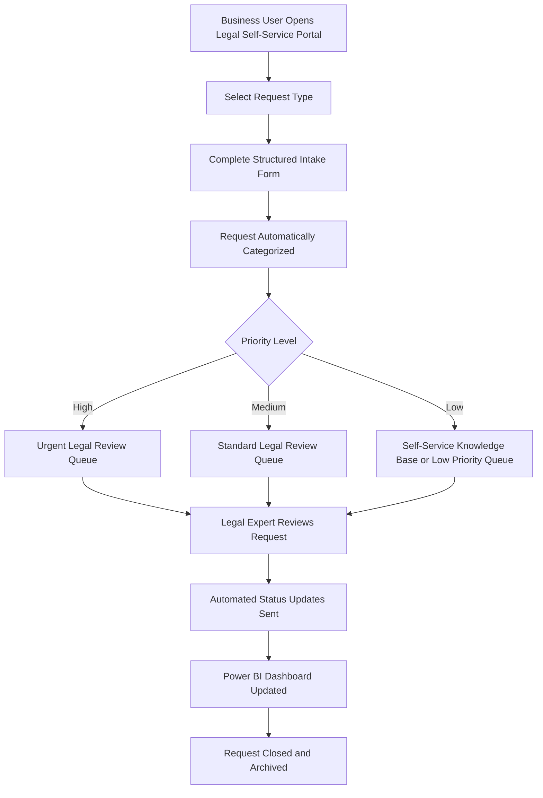

# Legal Self-Service Workflow

This document describes the future digital legal request workflow.
# Future-State Legal Self-Service Workflow

## Purpose

This document explains the future-state digital legal request workflow. The goal is to create a structured self-service process where business users can submit legal requests through a digital intake form instead of sending unstructured emails or chat messages.

## Future Process

1. Business user opens the Legal Self-Service Portal
2. User selects the request type
3. User completes a structured legal intake form
4. Request is automatically categorized
5. Priority is assigned based on risk and urgency
6. Request is routed to the correct legal expert or legal queue
7. Automated status updates are sent to the requester
8. KPI dashboard is updated for transparency
9. Completed requests are archived for reporting and continuous improvement

## Future-State Process Flow

## Request Categories

| Request Type | Example Business Need |
|---|---|
| Contract Review | Review supplier, customer, or partner agreements |
| Data Protection / GDPR | Clarify privacy or personal data handling questions |
| Vendor Documentation | Review legal or compliance-related vendor documents |
| Debt Collection Process Support | Clarify legal requirements in collection-related workflows |
| Compliance Policy Question | Support business teams with internal policy interpretation |
| Customer Communication Review | Review sensitive customer-facing wording |
| General Legal Guidance | Answer basic legal process or policy questions |

## Priority Logic

| Priority | Criteria | SLA Target |
|---|---|---|
| High | Regulatory risk, customer impact, urgent business deadline | 1-2 business days |
| Medium | Contract or operational request with business dependency | 3-5 business days |
| Low | General legal information or policy clarification | 5-7 business days |

## Benefits

- Reduced manual legal intake
- Better user experience for business teams
- Clearer prioritization
- Improved reporting transparency
- Faster routing of requests
- Stronger collaboration between Legal, IT, Operations, and business teams
- Scalable legal service delivery model

## Skills Demonstrated

- Future-state process design
- Legal operations understanding
- Workflow thinking
- Stakeholder experience improvement
- SLA and prioritization logic
- Cross-functional process improvement
