# Legal Operations Digital Transformation Toolkit

## Project Overview

This repository contains a simulated Legal Operations transformation project designed to demonstrate practical understanding of legal service delivery, process improvement, workflow automation, KPI reporting, stakeholder self-service, and low-code/no-code solution design.

The project focuses on improving how legal requests are received, prioritized, tracked, automated, and reported across an organization.

## Project Scenario

A growing fintech-style company receives a high volume of legal and compliance-related requests from internal teams. These requests include contract reviews, data protection questions, vendor documentation, compliance policy support, debt collection process queries, and customer communication reviews.

The current process is largely manual, email-based, and difficult to track. This project proposes a structured Legal Operations solution using digital intake forms, workflow automation, KPI dashboards, stakeholder training, and continuous improvement principles.

## Project Objectives

- Create a standardized legal request intake process
- Improve transparency across legal service delivery
- Reduce manual follow-ups through automation
- Build KPI visibility for legal workload and turnaround times
- Support business teams through digital self-service tools
- Improve collaboration between Legal, IT, Operations, and business stakeholders
- Apply process improvement and change management methods

## Key Deliverables

| Area | Deliverable |
|---|---|
| Project Planning | Project Charter |
| Process Improvement | Current-State Legal Request Process |
| Workflow Design | Future-State Legal Self-Service Workflow |
| Automation | Power Automate Workflow Logic |
| Reporting | Legal Operations KPI Dashboard Mockup |
| Data | Sample Legal Operations Dataset |
| Training | Legal Tech User Guide |
| Risk Management | Risk Register |
| Change Management | Change Management Plan |
| UX / Legal Design | Legal Request Form UX Design |

## Repository Structure

```mermaid
flowchart TD

A[Legal Operations Digital Transformation Toolkit] --> B[01 Project Overview]
A --> C[02 Current State Assessment]
A --> D[03 Future State Workflow]
A --> E[04 Automation Design]
A --> F[05 KPI Dashboard]
A --> G[06 Stakeholder Training]
A --> H[07 Risk & Change Management]
A --> I[08 Legal Design UX]

B --> B1[Project Charter]

C --> C1[Current Legal Request Process]
C --> C2[Pain Points & Improvement Opportunities]

D --> D1[Legal Self-Service Workflow]
D --> D2[SLA & Priority Logic]

E --> E1[Power Automate Workflow Logic]
E --> E2[Routing, Notifications & Escalations]

F --> F1[KPI Dashboard Mockup]
F --> F2[Sample Legal Ops Dataset]

G --> G1[Legal Tech User Guide]
G --> G2[Stakeholder Adoption Support]

H --> H1[Risk Register]
H --> H2[Change Management Plan]

I --> I1[Legal Request Form UX Design]
I --> I2[User-Friendly Legal Intake Form]

classDef main fill:#f4f4f4,stroke:#333,stroke-width:2px;
classDef section fill:#e8f3ff,stroke:#2563eb,stroke-width:1px;
classDef file fill:#f9fafb,stroke:#6b7280,stroke-width:1px;

class A main;
class B,C,D,E,F,G,H,I section;
class B1,C1,C2,D1,D2,E1,E2,F1,F2,G1,G2,H1,H2,I1,I2 file;
```

